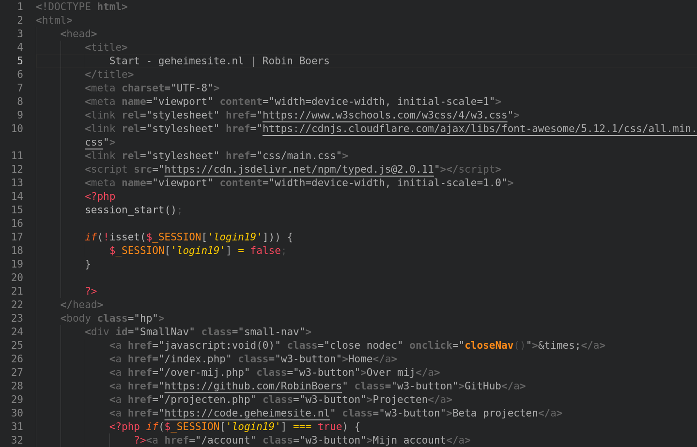
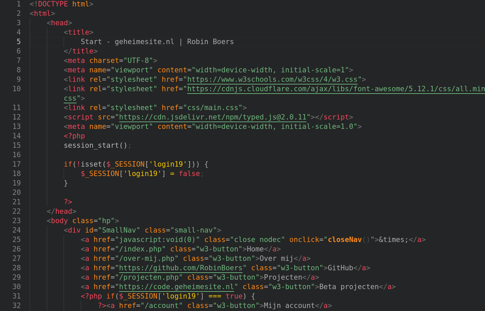
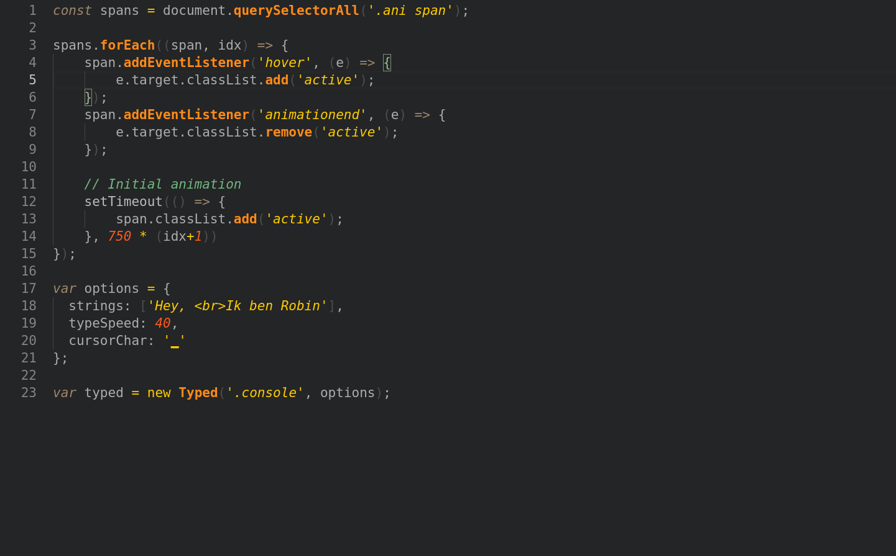
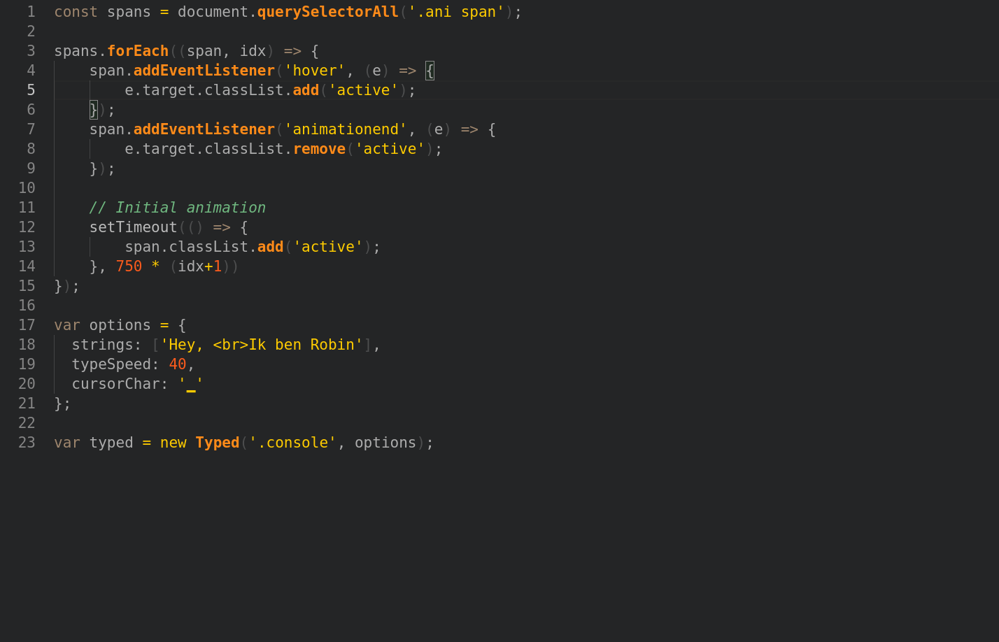

# Frontend Delight

Frontend Delight is my favorite color scheme.  
I use it in Vim, Alacritty, Firefox, Qtile and Spotify. I also made it into a VSCode color scheme.  
It isnt perfect, but good enough for me. The UI for v1.0.2+ is based on the GitHub Dark (Classic) theme.  
Enjoy :)

Original creator: <https://github.com/bernatfortet>

Version v1.0.3+ contains two color themes:

- **Frontend Delight**: the original Sublime Theme converted to VSCode
- **Frontend Delight Enhanced**: the same as the original, but with edits by me

## Screenshots

  
Default version displaying HTML and PHP  

  
Enhanced version displaying HTML and PHP  

  
Default version displaying JavaScript  

  
Enhanced version displaying JavaScript  

## Credits

<https://github.com/bernatfortet>
