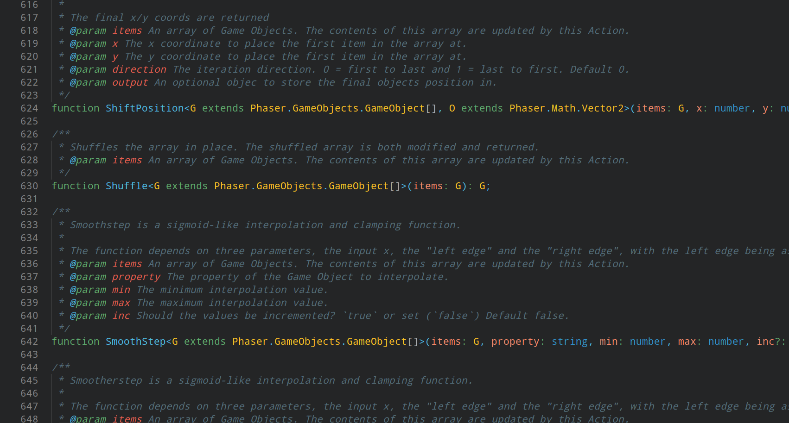

# Frontend Delight

Frontend Delight is my favorite color scheme.  
I use it in Vim, Alacritty, Firefox, Qtile and Spotify. I also made it into a VSCode color scheme.  
It isnt perfect, but good enough for me. v2 is based on the GitHub Dark theme.  
Enjoy :)

Original creator: <https://github.com/bernatfortet>

## Demo

If you were wondering, yes this is Phaser 3 code :)
